<div align="center">

# AgenticOS

**A full-stack template that makes Claude Code work like an engineering team, not an autocomplete.**

Lean context · CLI-first tooling · a delivery pipeline you cannot skip · memory that survives the session

</div>

<picture>
  <source media="(prefers-color-scheme: dark)" srcset="docs/diagrams/agenticos-stack-dark.svg">
  
</picture>

FastAPI (Python 3.12, uv) · React 18 + Vite + TypeScript + Tailwind + TanStack Query · SQLite for dev, hosted Postgres for production via one env var · Playwright e2e. No Docker, no MCP servers.

---

## Quick start

```bash
bash scripts/setup.sh
```

It checks every prerequisite, asks before installing anything, installs all three workspaces, runs every test suite, and generates the code map. Safe to re-run. On a fresh Windows box, run `scripts/setup.ps1` in PowerShell first. Per-platform walkthroughs: [macOS](docs/setup-macos.md) · [Windows](docs/setup-windows.md) · [Linux VPS](docs/setup-vps-linux.md).

<details>
<summary>Manual equivalent</summary>

```bash
# prerequisites: uv, node 22+ (the DB is SQLite — nothing else to install)
cd backend  && uv sync && cd ..
cd frontend && npm install && cd ..
cd e2e      && npm install && npx playwright install chromium && cd ..

bash scripts/test-all.sh        # everything should pass
bash scripts/graphify.sh        # generate the code map
claude                          # the SessionStart hook logs the session
```
</details>

Then drive the seeded example item through the whole pipeline: `/spec AOS-002`.

---

## The pipeline you cannot skip

Every unit of work moves through six stages, each one a slash command, each artifact a markdown file in `backlog/` that lives in git. Nothing gets built that isn't traceable to a backlog row.

<picture>
  <source media="(prefers-color-scheme: dark)" srcset="docs/diagrams/delivery-pipeline-dark.svg">
  
</picture>

Two things make this more than ceremony:

**Specs force testable acceptance criteria**, and `/implement` turns each criterion into a failing test *before* any code exists. The TDD loop is not a suggestion the model can talk itself out of.

**`/verify` runs an adversarial subagent** in a fresh context whose only job is to refute the work against the spec. A second model with no attachment to the code, no memory of writing it, and an explicit mandate to find the gap. That is what makes AI output trustworthy enough to merge.

### How an item moves

<picture>
  <source media="(prefers-color-scheme: dark)" srcset="docs/diagrams/backlog-item-dark.svg">
  
</picture>

Sign-off gates are conditional, not bureaucratic: spec always needs your approval, plan only for items touching more than three files or changing schema. Small work stays fast.

---

## Memory that outlives the session

Claude's built-in memory is machine-local and invisible to your team. This template keeps knowledge as markdown in git, so it is reviewable in PRs, shared across machines, and survives any model or tool change.

<picture>
  <source media="(prefers-color-scheme: dark)" srcset="docs/diagrams/memory-pipeline-dark.svg">
  
</picture>

| File | Holds | Written by |
|---|---|---|
| `memory/system-reference.md` | Generated code map — answers "where is X?" for a few hundred tokens | `scripts/graphify.sh` |
| `memory/gotchas.md` | Traps and footguns, written the moment one bites | the moment it happens |
| `memory/learnings.md` | Patterns that worked and why | `/done`, `/wrap-up` |
| `memory/features.md` | One line per shipped feature | `/done` |
| `memory/sessions/` | Per-session work logs | `/wrap-up` |

Entry formats are one line each, on purpose. These files are read by every future session, so verbosity there is a tax you pay forever.

---

## What the app actually does

The seeded app is deliberately small — a health endpoint and a status card — so the workflow is the thing you're evaluating, not the demo. It is wired end to end, including the proxy rewrite that catches most first-run 404s:

<picture>
  <source media="(prefers-color-scheme: dark)" srcset="docs/diagrams/health-request-dark.svg">
  
</picture>

---

## The six rules this encodes

**1. Minimize tokens.** Context is the constraint; a full window degrades quality and costs money.

- Root `CLAUDE.md` is under 40 lines. Every line should prevent a mistake.
- Rules in `.claude/rules/` use `paths:` frontmatter — backend rules load **only** when Claude touches backend files. A frontend session never pays for them.
- Domain knowledge lives in **skills** (loaded on demand), not in `CLAUDE.md`.
- The `scout` and `test-runner` subagents run in separate contexts, so file exploration and test logs never flood the main conversation.

**2. CLI > API > MCP.** ([`.claude/rules/tool-priority.md`](.claude/rules/tool-priority.md))

Every connected MCP server's tool schemas consume context in **every** session, used or not. A CLI call costs tokens only when used, is deterministic, and is versioned in git. Concretely: Playwright via `npx playwright test`, the database via SQLite or `psql`, the code map via a stdlib-only `scripts/graphify.py`. Reach for MCP only when neither a CLI nor a script can do the job.

**3. A mandatory pipeline.** ([`.claude/rules/workflow.md`](.claude/rules/workflow.md)) — see above.

**4. Repo-local memory.** ([`.claude/rules/memory.md`](.claude/rules/memory.md)) — see above.

**5. Map first, RAG later.** ([`.claude/skills/graphify/SKILL.md`](.claude/skills/graphify/SKILL.md))

`bash scripts/graphify.sh` parses Python with `ast` and TS/TSX with regex into a compact module and import-graph map. Zero dependencies, zero index staleness, `--check` for CI. Agentic grep plus a good map beats embeddings for most repos; the upgrade path when you outgrow it is a local sqlite-vec index behind a CLI, still not an MCP server. Reasoning: [`docs/code-intelligence-options.md`](docs/code-intelligence-options.md).

**6. Guardrails are enforced, not requested.**

`.claude/settings.json` **denies** reading or writing `.env` files and blanket `curl`/`wget`, **asks** before `git push` and `rm -rf`, and pre-**allows** the safe frequent commands so Claude works without permission friction. Hooks run regardless of what the model decides: `session-start.sh` stamps the log and surfaces in-flight items, `format-changed.sh` runs ruff and prettier on every edit so formatting never burns a turn.

---

## Layout

```
CLAUDE.md            lean root instructions (<40 lines — by design)
.claude/
  settings.json      permissions (allow/deny/ask) + hooks
  rules/             modular rules; backend/frontend/testing are PATH-SCOPED
  commands/          /backlog /spec /plan-item /implement /verify /done /wrap-up
  agents/            scout (explorer), verifier (adversarial review), test-runner
  skills/            memory, graphify — ~0 tokens until invoked
  hooks/             session-start.sh, format-changed.sh
backend/  frontend/  e2e/   separate apps, each with its own short CLAUDE.md
backlog/             backlog.md + specs/ + plans/ (with templates)
memory/              learnings, gotchas, features, system-reference, sessions/
scripts/             setup.sh, graphify.py, test-all.sh, dev.sh — plain CLI, no deps
docs/                per-platform setup + diagrams + background research
.github/workflows/   ci.yml + claude.yml (@claude on PRs/issues)
```

## Environment variables and secrets

Three layers, same convention in every folder:

1. **`.env.example`** — committed. The schema: every variable, a safe default or placeholder, a comment. Adding a variable without updating it is unfinished work.
2. **`.env`** — gitignored. Real local values.
3. **`.env.local`** — gitignored. Personal overrides; wins over `.env`. Native in pydantic-settings and Vite.

`.gitignore` blocks committing them and `.claude/settings.json` denies Claude read/write on them, so the model sees the schema and never the secrets. Frontend caveat: `VITE_*` variables are compiled into public JS, so secrets stay server-side. When you outgrow local files, inject env vars at runtime from a secrets manager — the app code doesn't change, which is the point.

## Making it your own

Nothing here is load-bearing for the app, so prune freely:

- **The pipeline is strict on purpose.** If `/spec` → `/plan-item` is too heavy for small work, loosen it in `.claude/rules/workflow.md` rather than quietly skipping stages.
- **`scripts/sync-memory.sh` is optional.** It promotes long-term learnings to a template repo you control, asking for that path on first run. Not maintaining a fork? Ignore it.
- **Seeded memory.** `learnings.md` and `gotchas.md` ship with real findings, mostly cross-platform setup traps, deliberately undated. Delete what isn't yours and start dating your own.
- **The example item.** `AOS-002` exists so you can drive the pipeline once. Delete it afterwards.
- **Diagrams.** `docs/diagrams/*.svg` are generated, two themes each. Regenerate with `cd e2e && node export-diagrams.mjs .. ../docs/diagrams`, or delete them: see [`docs/diagrams/README.md`](docs/diagrams/README.md).

## Optional add-ons

- **GitHub app** — run `/install-github-app` inside Claude Code to wire `claude.yml`, which responds to `@claude` on PRs and issues.
- **Superpowers** (third-party SDLC skills) — `claude plugin marketplace add obra/superpowers-marketplace`, then install. This template's pipeline is self-contained; superpowers layers on extra craft skills.

## Daily rhythm

Start `claude`, check the surfaced in-flight items, `/backlog show`. Work `/spec` → `/plan-item` → `/implement` → `/verify` → `/done`, compacting between items. End with `/wrap-up`. Weekly: `/backlog groom`, prune memory files past ~150 lines, run `bash scripts/graphify.sh --check`.

## License

MIT — see [LICENSE](LICENSE).
